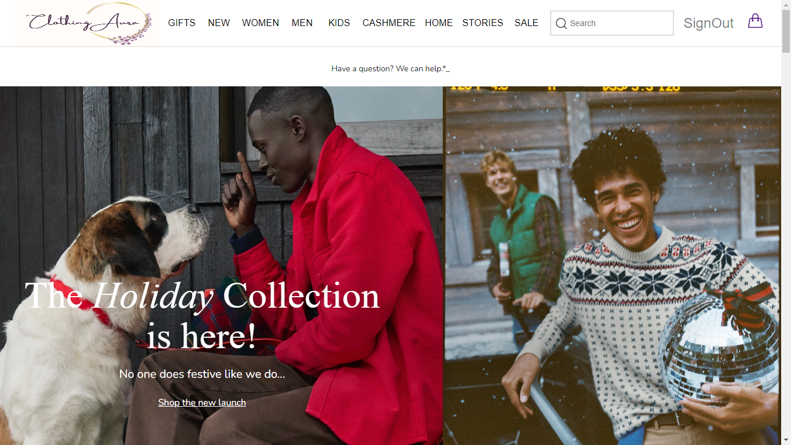
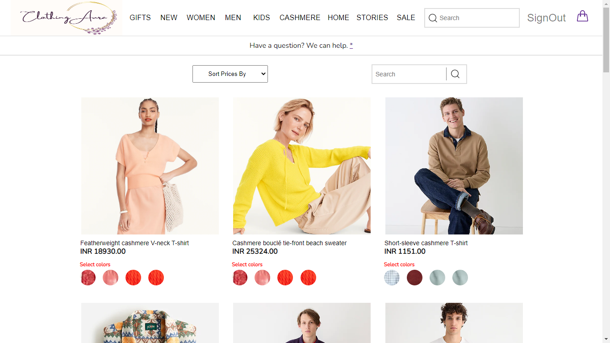
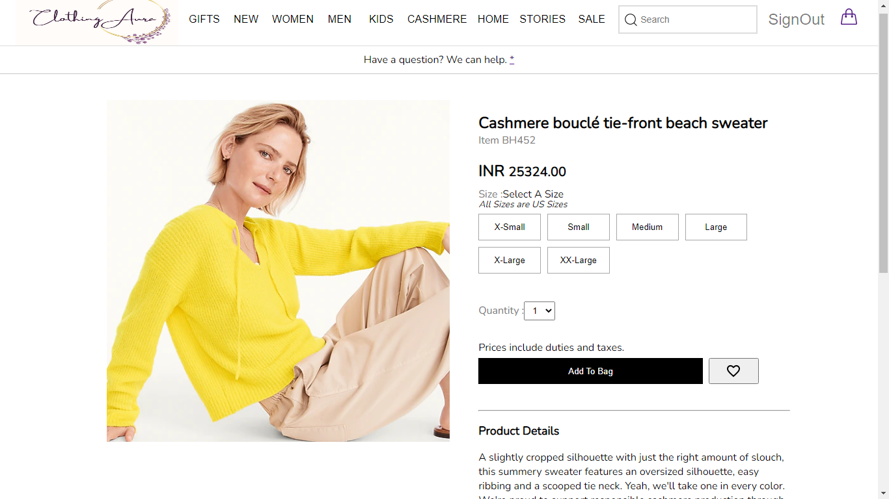
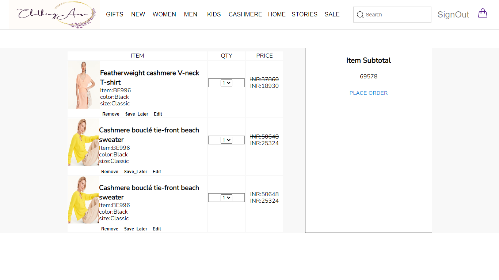

# Clothing Aura
This was a collaborative project made by 5 members Executed in 5 days.
 

  Deploy Link -Netlify: 
  Backend Api Link : https://nice-kit-boa.cyclic.app/
---
## Tech Stack Used : -
- ####  Tech Stack Used
  - `React`              - `Express`
  - `Redux `             - `MongoDB`
  - `CSS`                - `Mongoose`
  - `Javascript`         - `NoSQL`
 
- #### Libraries
  - `chakra-ui`
    - `Swiper`
     - `styled component `
---
### _Following are the Screenshots for the reference_
- **Home Page**

**Product Page**

- **SignIn Product _Page**

- **Cart_page**

Cothing Aura
Web site created using create-react-app

